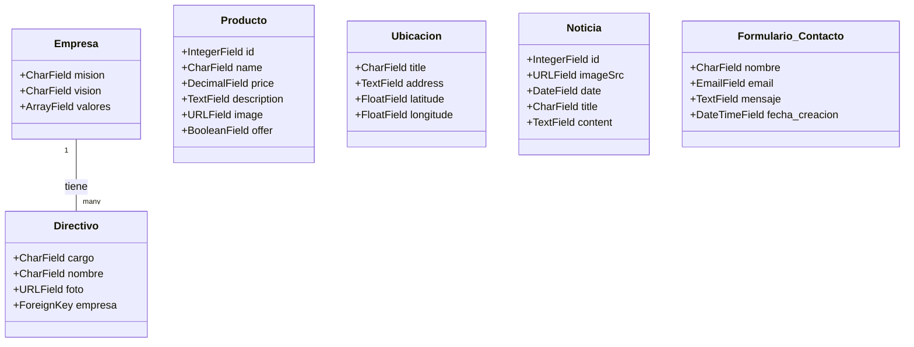

## Evaluación en Contacto con el Docente

First, run the development server:

### Ejecutar Next

```bash
npm install
npm run dev
```

### Ejecutar Django

```bash
cd Backend
pip install -r requirements.txt
python manage.py migrate
```

## Tecnologias

- Nextjs (Typescripy)
- Tailwend
- Django (Pyhton)
- SQL (SQLite)

## Diagrama ORM

Diagrama ORM para un modelo Django basado en cada una de las páginas del proyecto.


